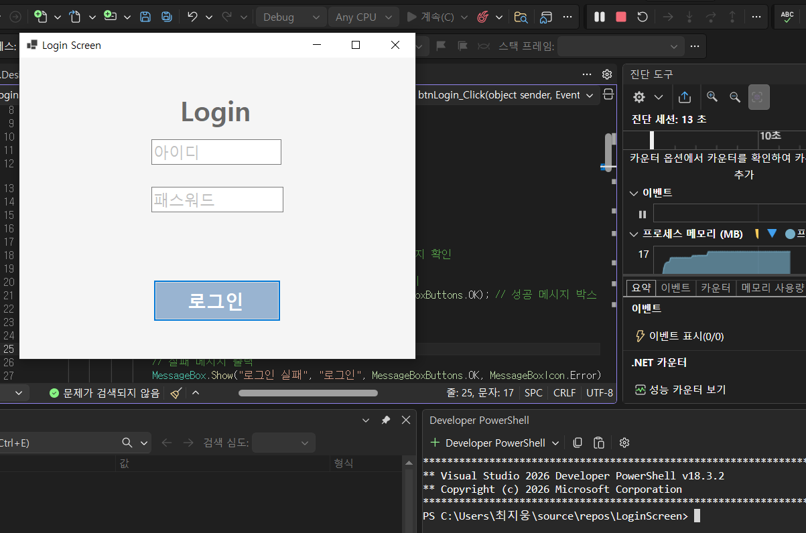

# (C# 코딩) LoginScreen

## 실행 화면 (과제1)
- 과제1 코드의 실행 스크린샷

- 과제 내용
- Label 1개, TextBox 2개, Button 1개를 배치하여 로그인 화면을 구성했다.
- 아이디와 비밀번호 입력창에 Placeholder를 표시했다.
- 아이디와 비밀번호가 모두 맞을 때만 로그인 성공 메시지를 출력한다.
- 하나라도 틀리면 로그인 실패 메시지를 출력한다.

- 구현 내용과 기능 설명
- 아이디 입력창은 기본 안내 문구가 회색으로 표시된다.
- 비밀번호 입력창은 입력 시 비밀번호 문자가 가려지도록 처리했다.
- 로그인 버튼을 누르면 아이디와 비밀번호를 비교하여 성공 또는 실패를 알려준다.