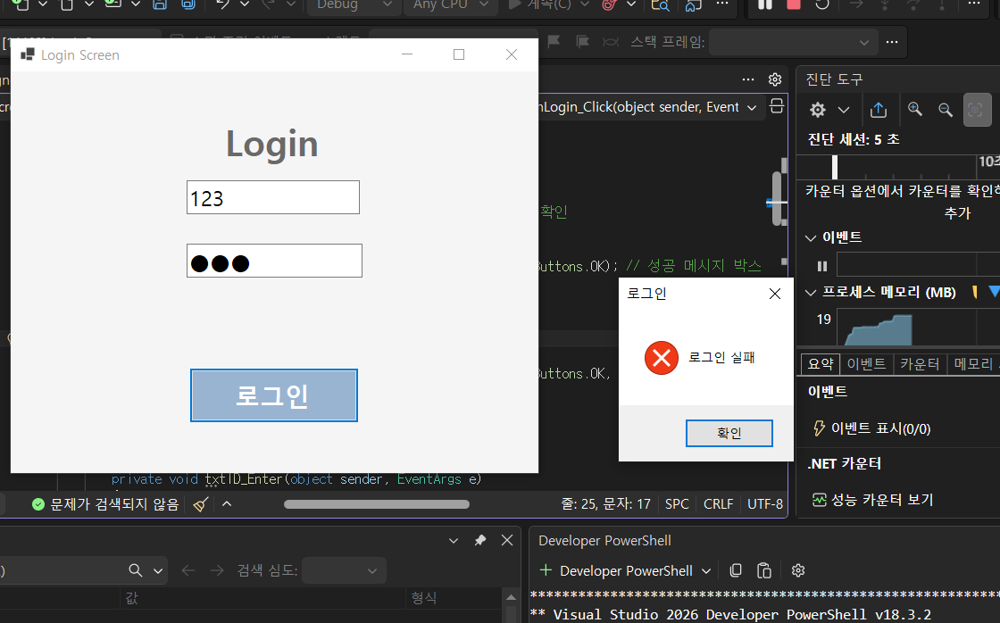
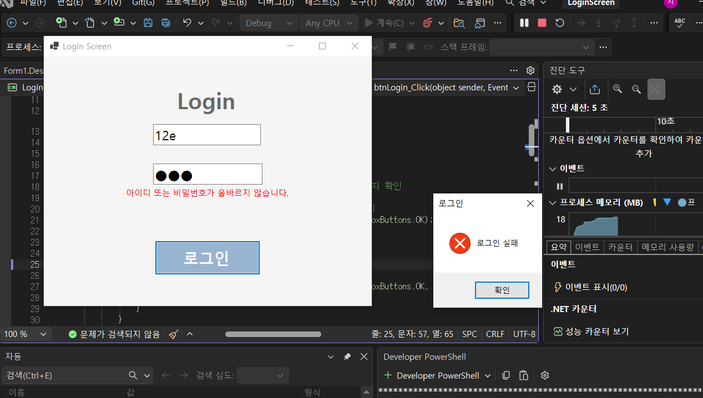

# (C# 코딩) LoginScreen

## 개요
- C# WinForms를 활용한 로그인 화면 구현
- 1줄 소개: 아이디와 비밀번호를 입력하여 로그인 여부를 확인하는 프로그램

- 사용한 플랫폼
- C#, .NET Windows Forms, Visual Studio, GitHub

- 사용한 컨트롤
- Label, TextBox, Button, CheckBox

- 구현한 기능
- TextBox를 이용한 아이디 및 비밀번호 입력 기능
- Placeholder를 활용한 입력 안내 기능
- 비밀번호 입력 시 문자 가리기 기능
- 로그인 성공/실패 판별 기능 (조건문 && 사용)
- 에러 메시지를 Label로 화면에 표시 (Visible 속성 활용)
- Enter 키로 입력 흐름 제어 및 로그인 실행

## 실행 화면 (과제1)
- 과제1 코드의 실행 스크린샷

- 과제 내용
- Label 1개, TextBox 2개, Button 1개를 배치하여 로그인 화면을 구성
- 아이디와 비밀번호 입력창에 Placeholder를 표시
- 아이디와 비밀번호가 모두 맞을 때만 로그인 성공 메시지를 출력
- 하나라도 틀리면 로그인 실패 메시지를 출력

- 구현 내용과 기능 설명
- 아이디 입력창은 기본 안내 문구가 회색으로 표시된다
- 비밀번호 입력창은 입력 시 비밀번호 문자가 가려지도록 처리했다
- 로그인 버튼을 누르면 아이디와 비밀번호를 비교하여 성공 또는 실패를 알려준다
- Enter 키를 누르면 로그인 버튼이 실행되도록 설정했다

## 실행 화면 (과제2)
- 과제2 코드의 실행 스크린샷

- 과제 내용
- 로그인 실패 시 MessageBox 대신 화면에 에러 메시지를 표시
- Label의 Visible 속성을 사용하여 메시지를 보이거나 숨기도록 구현

- 구현 내용과 기능 설명
- 아이디 또는 비밀번호가 틀리면 빨간색 에러 문구가 화면에 나타난다
- 입력창을 다시 클릭하면 에러 문구가 자동으로 사라진다
- 로그인 성공 시에는 에러 문구를 숨기고 성공 메시지를 출력한다
